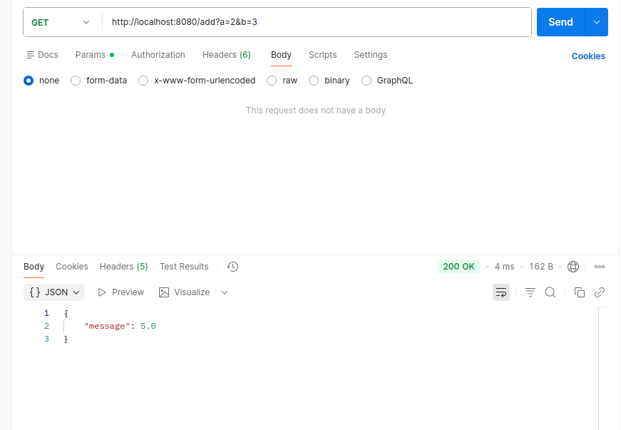
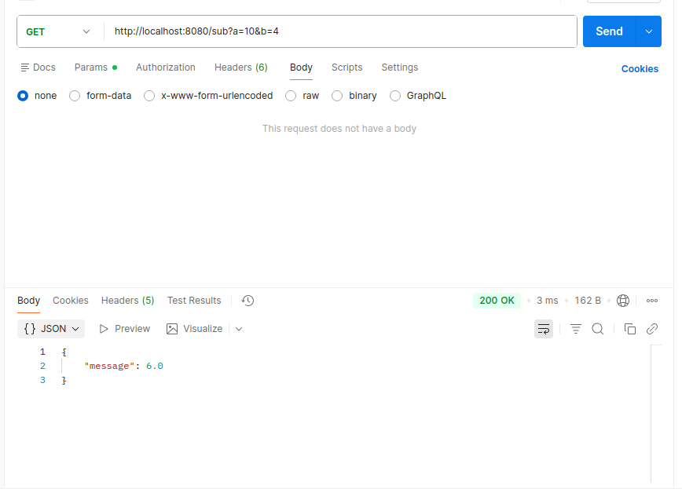
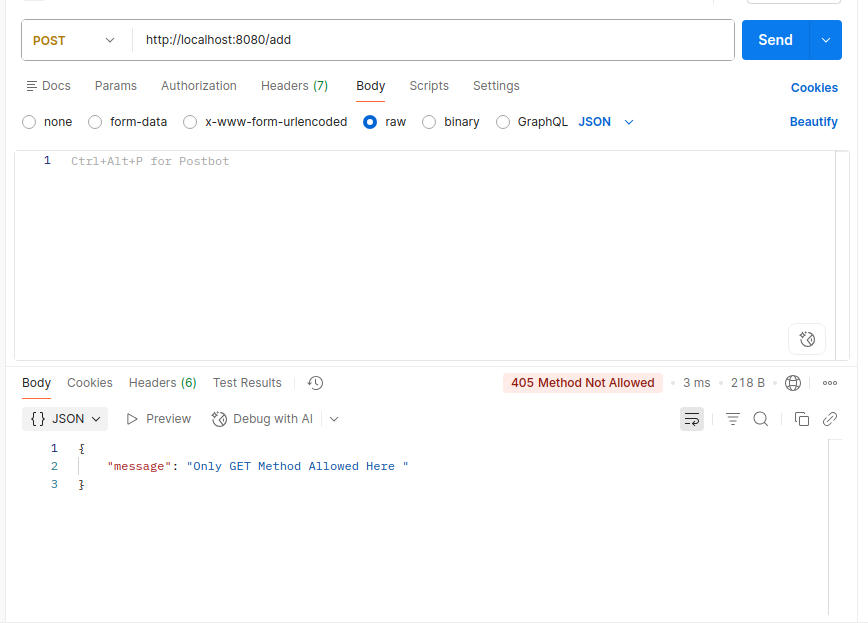
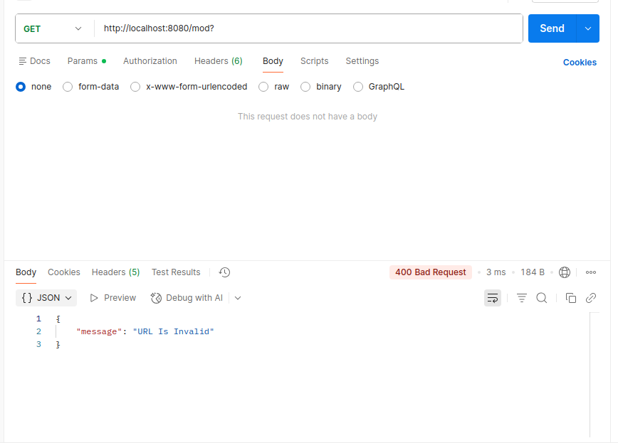

<div align="center">

# ☎️ Socket Calculator
### *"Build a calculator that stays on the line"*

`Python` · `raw TCP sockets` · `no frameworks`

</div>

---

A calculator server built directly on top of a raw TCP
socket — no `http.server`, no framework. One socket, opened once, answers
every request sent down it. 

```bash
python3 server.py
# -> Socket is bound to Host: 127.0.0.1 and is Listening on PORT: 8080
```

---

## 📋 What it does

The server does a single `accept()`, then loops on that one connection,
`recv()`-ing, parsing, and replying, forever — which is the actual point
of the assignment: staying **on the line** instead of accepting a fresh
socket per request the way a naive HTTP/1.0-style server would.

Supported routes (GET only):

| Request | Result |
|---|---|
| `GET /` | `200` — welcome message |
| `GET /add?a=2&b=3` | `200` — `5` |
| `GET /sub?a=10&b=4` | `200` — `6` |
| `GET /mul?a=6&b=7` | `200` — `42` |
| `GET /div?a=9&b=3` | `200` — `3` |
| `GET /div?a=1&b=0` | `400` — division by zero rejected |
| `GET /add?a=x&b=3` | `400` — non-numeric parameter rejected |
| `GET /pow?a=2&b=8` | `404` — path not in the allow-list |
| `POST /add` | `405` — only `GET` is allowed, `Allow: GET` header sent |

Every response is JSON, e.g.:

```json
{"message": 5}
```

---

## 🛠️ How it's built

- **`__main__()`** — creates the listening socket, accepts one client, then
  loops: `recv` → `parseHeaders` → `parseMethod` → `send`.
- **`parseHeaders()`** — walks the header lines and rejects malformed ones
  (missing `:` , empty key/value) with a `400`.
- **`parseMethod()`** — validates the request line has exactly 3 tokens,
  enforces `GET`, checks the path against an allow-list, splits and
  validates the `a=`/`b=` query parameters, and dispatches to
  `add` / `sub` / `mul` / `div`.
- **`checkFloat()`** — guards against non-numeric input before doing the
  arithmetic.
- **`successMessage()` / `errMessage()`** — hand-build the HTTP/1.1
  response (status line, `Date`, `Content-Type`, `Content-Length`,
  `Connection: keep-alive`, body) and return raw bytes.

---

## 🚧 What I'd still improve

The brief calls out that the *real* difficulty of a keep-alive server
is framing — knowing exactly where one request ends and the next
begins, since there's no connection close to mark EOF anymore. That's
the part of my solution that's weakest, and where I'd focus next:

- **Exact request framing.** Right now a single `recv(1024)` call is
  assumed to contain exactly one request. In reality TCP gives no such
  guarantee: a request can arrive split across several `recv()` calls,
  or several requests can arrive fused together in one `recv()` call
  (pipelining). I'm not yet buffering and parsing up to the end of the
  headers (`\r\n\r\n`) and reading exactly `Content-Length` bytes of body
  after that — I'm trusting one `recv` per request, which is the "byte
  n+1 belongs to somebody else" problem the assignment warns about.
- **Pipelining.** Following on from the point above, I don't handle a
  client firing all six requests at once and expecting six answers back
  in order — my parser would choke on the concatenated buffer.
- **Multiple clients.** `accept()` is only ever called once, before the
  loop — so only a single connection is served for the process's
  lifetime. A real server would loop on `accept()` (or use
  `select`/threads) to serve more than one client, or at least accept a
  new client once the current one disconnects.

None of this affects the six sample requests in the assignment's demo —
they all arrive as separate, complete `recv()` calls — but it's the gap
between "passes the demo" and "actually correct" HTTP/1.1 framing.

---

## ▶️ Example session

```
$ python3 server.py
Socket has been created
Socket is bound to Host: 127.0.0.1 and is Listening on PORT: 8080
Client IP Address Is: ('127.0.0.1', 52344)
```

```
GET /add?a=2&b=3     -> 200  {"message": 5.0}
GET /sub?a=10&b=4    -> 200  {"message": 6.0}
GET /mul?a=6&b=7     -> 200  {"message": 42.0}
GET /div?a=9&b=3     -> 200  {"message": 3.0}
GET /div?a=1&b=0     -> 400  {"message": "Cannot Divide By 0 Here"}
GET /pow?a=2&b=8     -> 404  {"message": "Path Not Found"}
POST /add            -> 405  {"message": "Only GET Method Allowed Here"}
```

Try it yourself against the running server:

```bash
curl "http://127.0.0.1:8080/add?a=2&b=3"
curl "http://127.0.0.1:8080/div?a=9&b=3"
curl -X POST "http://127.0.0.1:8080/add"
```

### 📸 Screenshot

Drop your terminal / client output here:

<!--  -->

 
 
 
 
